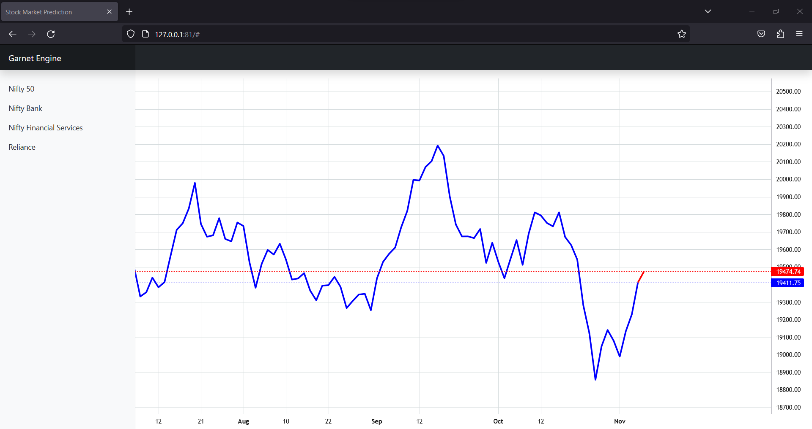
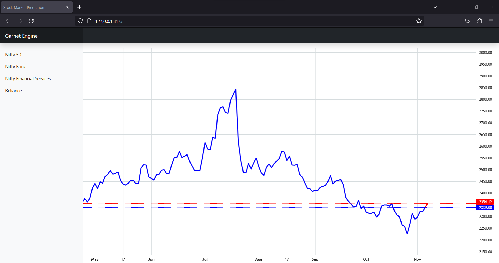

# Stock Market Prediction Web App 📈

This repository contains a simple web application for stock market prediction. The application is built using Flask, HTML, and Bootstrap. It provides an interface for viewing different stock indices and is designed to be a starting point for building more advanced stock prediction tools. It is purely made for a college project.

## Table of Contents 📋

- [Overview](#overview)
- [Getting Started](#getting-started)
- [Usage](#usage)
- [Dependencies](#dependencies)
- [Contributing](#contributing)
- [License](#license)

## Overview 🚀

The Stock Market Prediction web app is a basic web application that allows users to view various stock market indices. It currently supports the following indices:

- Nifty 50
- Nifty Bank
- Nifty Financial Services
- Reliance

In addition to the current features, the project has future plans for expansion, including the following:

- Integration of Machine Learning Models for Prediction 🤖
- Displaying Charts and Visualizations 📊
- Incorporating Tradingview Technical Analysis 📉

The application's user interface is minimal and user-friendly, thanks to the Bootstrap framework. Users can access different indices through the navigation menu on the left-hand side of the web page.

## Images 📷





## Getting Started 🚀

To run this application locally, follow these steps:

1. Clone this repository to your local machine:

   ```
   https://github.com/bhavanamn/GarnetMarketEngine.git
   ```

2. Navigate to the project directory:

   ```
   cd GarnetMarketEngine/
   ```

3. Install the required dependencies (Flask):

   ```
   pip install -r requirements.txt
   ```

4. Navigate to src folder:

   ```
   cd src
   ```
5. Run the following commands in succession:

   ```
   python model_creation.py
   ```
   ```
   python prediction.py
   ```
6. Return to base directory:
   ```
   cd ..
   ```

7. Run the Flask application:

   ```
   python main.py
   ```

8. Open a web browser and visit `http://localhost:81` to view the web application. (Kept on host=0.0.0.0 and port=81 for easy replit setup)

9. For accurate predictions run predictions.py daily.

## Usage 📊

- Upon running the application, you will be directed to the home page displaying the available stock market indices.
- Click on an index name in the navigation menu to view the corresponding stock index page.
- Explore the application to get a basic idea of its functionality.

## Dependencies 🛠️

The following dependencies are used in this project:

- [Flask](https://flask.palletsprojects.com/en/2.1.x/): A micro web framework for Python.
- [Bootstrap](https://getbootstrap.com/): A popular HTML, CSS, and JavaScript framework for building responsive and mobile-first web applications.
- [Lightweight Charts](https://github.com/tradingview/lightweight-charts): Framework to plot charts.
- [Keras](https://keras.io/): For machine learning framework.

## Contributing 🤝

Contributions to this project are welcome. If you have any ideas or improvements you'd like to see implemented, please open an issue or submit a pull request.

## License 📜

This project is licensed under the MIT License - see the [LICENSE](LICENSE) file for details. 📄
